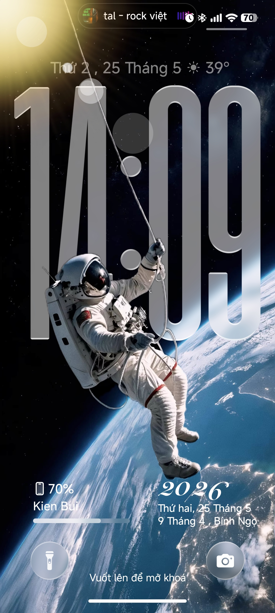
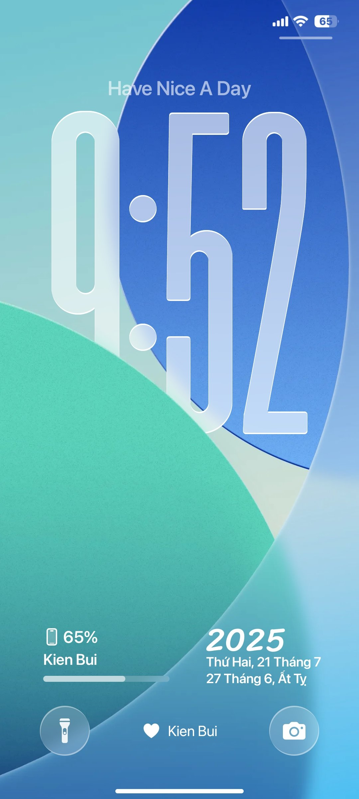

# IOS Extended - Premium HyperOS Theme

IOS Extended is a custom theme designed for Xiaomi, Redmi, and POCO devices running HyperOS. It brings a refined, premium iOS-inspired user interface design to your device, featuring advanced depth wallpapers, a customizable lockscreen, Dynamic Island interactions, and clean typography.

## Features

- **Dynamic Lockscreen & Depth Parallax**: Custom portrait-depth wallpaper engine with simulated gravity parallax effects.
- **Dynamic Island Integration**: Real-time status indicators for charging, flashlight, notifications, and music playback.
- **Immersive Standby Mode**: Landscape charging visualizer with night-shift red filter capabilities.
- **Customizable Widgets**: Built-in clock styles, favorite app docks, calendar views, and notification tracking.
- **Custom Always-On Display (AOD)**: Matches active lockscreen layout and colors.

## Compilation and Installation Guide

Since Xiaomi devices require compiled `.mtz` (Mi Theme Zip) files for theme installation, follow these steps to build and apply the theme:

### Prerequisites

- A Xiaomi, Redmi, or POCO device running HyperOS.
- An authorized Xiaomi Designer Account or a third-party theme installer (e.g., MTZ Tester or HyperOS Theme Editor) to apply unofficial packages.

### Building the MTZ File

1. Clone this repository to your local machine:
   ```bash
   git clone https://github.com/DevInfinix/IOS-Extended.git
   ```
2. Compress all the files inside the root folder (including `description.xml`, `lockscreen`, `clock_2x4`, `icons`, etc.) into a `.zip` archive.
   *Note: Ensure the root folders are directly at the top level of the zip structure, not inside a subfolder.*
3. Rename the resulting file's extension from `.zip` to `.mtz`.

### Applying the Theme

1. Copy the `.mtz` file to your device's internal storage.
2. Open your theme manager app (or MTZ installer app of your choice).
3. Import the `.mtz` file.
4. Select "IOS Extended" and apply. Restart your device after applying to ensure system-wide resources (like Status Bar and Control Center elements) load correctly.

---

## Technical Visualizations & Preview Space

Below are preview mockups showing lockscreen customization configurations:

<!-- Previews -->
| Lockscreen Interface | Settings Menu |
| --- | --- |
|  |  |

---

## Support and Community

For feedback, issue reporting, and suggestions, please join our community channel on Telegram:

- **Telegram Discussions**: [DevInfinix Labs Discussions](https://t.me/devinfinix_labs_discussions)
- **Website**: [thesamstudios.pages.dev](https://thesamstudios.pages.dev)

---

## Legal Disclaimer and Provenance

This theme is an adapted work based on public community assets, which has been heavily modified, reprogrammed, and translated by DevInfinix. 

- This project is not affiliated with, authorized, or endorsed by Xiaomi Inc. or Apple Inc.
- All original design and structure adaptions remain the property of their respective creators.
- The modifications, configuration structures, translations, and custom code scripts compiled in this repository are owned exclusively by DevInfinix.

## License

This project is licensed under a strict proprietary license. Refer to the [LICENSE](file:///LICENSE) file for details. Unauthorized redistribution, commercial modification, sublicensing, or publishing the theme to third-party marketplaces is strictly prohibited.
